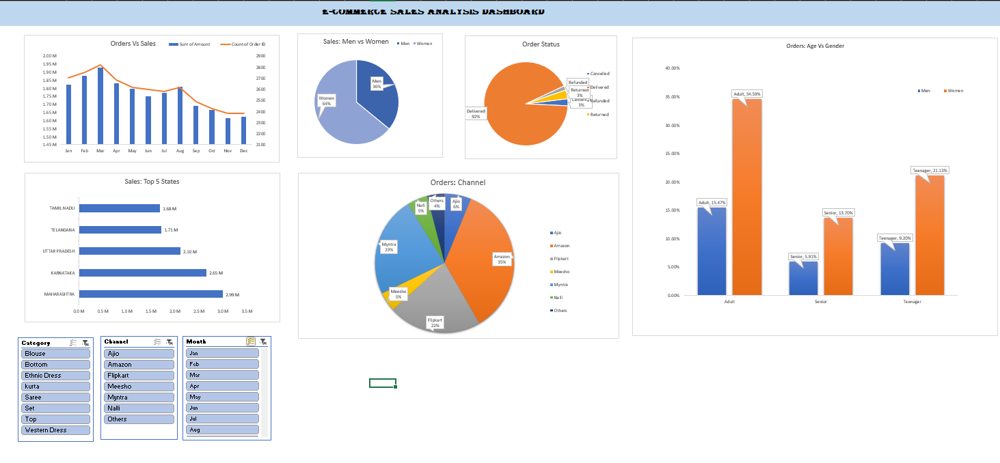

# 🛒 E-Commerce Sales Analysis Dashboard

> 📊 An interactive Microsoft Excel dashboard for analyzing e-commerce sales, orders, customers, channels, and geographical performance.

---

## 📌 Project Overview

This project is an **interactive E-Commerce Sales Analysis Dashboard** created using **Microsoft Excel**.

The dashboard transforms raw e-commerce data into meaningful business insights using **Pivot Tables, Pivot Charts, and interactive Slicers**.

The analysis focuses on:

- 📈 Monthly sales and order trends
- 👥 Customer demographics
- 🚻 Gender-wise sales performance
- 📦 Order status analysis
- 🗺️ State-wise sales performance
- 🛍️ Sales channel analysis
- 👨‍👩‍👧 Age and gender-wise order analysis

---

## 🖼️ Dashboard Preview

<p align="center">
  
</p>

---

## 🎯 Project Objective

The main objective of this project is to analyze **e-commerce sales and order data** and present the findings through an interactive Excel dashboard.

The dashboard was created to:

- Understand monthly sales and order trends
- Compare sales performance between men and women
- Analyze order status distribution
- Identify top-performing states
- Understand order distribution across age groups and genders
- Analyze orders across different sales channels

---

## 💡 Business Questions

The dashboard was designed to answer the following business questions:

1. How do sales and orders change over time?
2. How does sales performance vary between men and women?
3. What is the distribution of order status?
4. Which states have the highest sales?
5. How are orders distributed across different age groups and genders?
6. Which sales channels generate the most orders?

---

## 📊 Analysis Performed

The following analysis was performed using Microsoft Excel:

- Monthly sales and order analysis
- Gender-wise sales analysis
- Order status analysis
- Top 5 states by sales
- Age group and gender-wise order analysis
- Sales channel-wise order analysis
- Interactive filtering using slicers

---

## 📊 Dashboard Components

The dashboard contains multiple **Pivot Charts** and **interactive Slicers**.

### 📈 Charts

- **Orders vs Sales by Month**
- **Sales: Men vs Women**
- **Order Status**
- **Sales: Top 5 States**
- **Orders: Age & Gender**
- **Orders: Channel**

### 🎛️ Interactive Slicers

- 🛍️ Category
- 🏪 Channel
- 📅 Month

These slicers allow users to filter the dashboard and explore the data from different perspectives.

---

## 🔍 Key Insights

The dashboard helps identify:

- Monthly changes in sales and order volume
- Differences in sales between male and female customers
- Distribution of different order statuses
- States with higher sales performance
- Order distribution across age groups and genders
- Contribution of different sales channels to total orders

---

## 🛠️ Tools & Skills Used

### Microsoft Excel

- Data Cleaning
- Data Analysis
- Pivot Tables
- Pivot Charts
- Slicers
- Data Visualization
- Dashboard Creation
- Business Analysis

---

## 📁 Project Structure

```text
01_ECommerce_Sales_Dashboard
│
├── 📂 Data
│   └── raw_dataset.xlsx
│
├── Dashboard.png
│
├── 📊 ECommerce_Sales_Dashboard.xlsx
│
└── README.md
